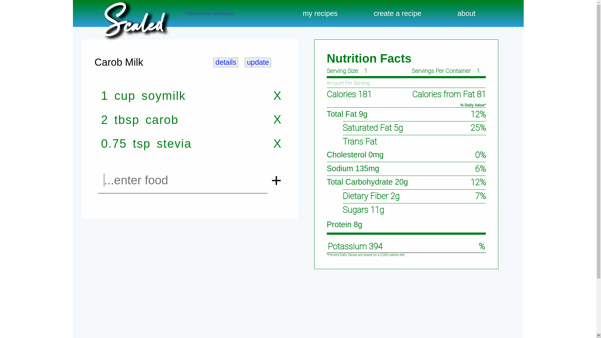

***Mick Roth***


## Scaled

   Scaled is a recipe calculator that allows users to calculate a ```nutrition facts``` label based on given ingredients. Natural language processing is available, for e.g., '1/2 cup strawberries.' The app uses the free tier of the nutritionix API. Unfortunately this limits calls to 200/day, including undefined returns but is sufficient to showcase the functionality. Also users can save recipes that when retrieved do not make an api call. 
 


### &#127883; Technologies	
- React
- React Hooks
- React Router
- React Icons
- Sass
- Mongo
- Mongoose

<br>

### &#127755; Diagrams

   - Screenshot




<br>

### &#128755; Api
- [Nutritionix](https://developer.nutritionix.com/)
- 


<br>

### &#127758; Deployed
- [Current Site on Netlify](https://scaled-nutrition-facts.netlify.app/)


<br>

<br>
